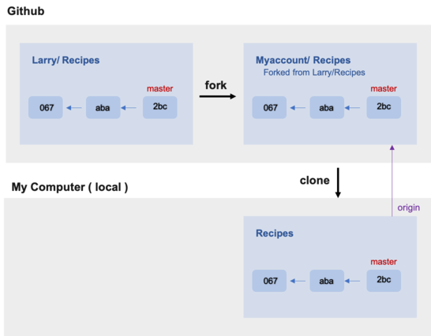

## 왜 개발자들은 Git을 사용하는가
참고: [https://git-scm.com/book/ko/v2](https://git-scm.com/book/ko/v2)

### 효율적인 협업
`fork`는 다른 사람의 Github repository에서 자신이 특정 부분을 수정하거나 보와하고 싶을 때 해당 respository를 자신의 repository로 그대로 복제하는 기능이다. 
여기서 연결 되어 있다는 의미는 original repository에 어떤 변화가 생기면, 나의  repository에 반영된다는 것이다. 이 때 `fetch origin`을 사용하게 된다.

그 후, original repository에 자신의 변경 사항을 적용할 때에 해당 저장소에 `pull request`를 한다. `pull request`가 original repository의 관리자에게 승인되면 original repostiory에 반영되게 된다. 승인되지 않으면, 자신의 repository에만 반영이 된다.

### 효율적인 버전관리
`commit`이라는 명령어로 자신이 작성한 코드를 저장소에 기록할 수 있다.
> 버그 수정, 기능 추가 등 특별한 의미가 있는 업데이트를 작업 별로 각각 커밋하면, 나중에 이력을 보고 특정 변경 내용을 찾기 쉽다.

커밋은 이처럼 이력이 남게되는 중요한 작업이기 때문에, 커밋을 할 때에는 메시지를 필수로 입력해야 한다.

꼭 지켜야 하는 것은 아니지만, 대체적으로 이러한 양식을 지켜주면 좋다. 
> 1번째 줄 : 커밋 내의 변경 내용을 요약  
2번째 줄 : 빈 칸  
3번째 줄 : 변경한 이유

참고로, 되돌리기는 `revert`를 사용하여 가능하다. 기록은 남게 된다.

### branch를 사용한 동시에 여러 작업 진행
브랜치란 독립적으로 각각의 작업을 진행하기 위한 도구이다. 필요에 의해 만들어지는 각각의 브랜치는 다른 브랜치의 영향을 받지 않기 때문에, 여러 작업을 동시에 진행할 수 있다.
또한, 작업한 후에 `merge`를 통하여 하나의 branch로 모을 수 있다.

### 작업 방식
> `fork` -> 작업할 branch 생성 -> `commit` -> `push origin` -> `pull request` -> 승인

### 다운로드 링크
- [git](https://git-scm.com/downloads)
- [GitHub Desktop](https://desktop.github.com/)

자신이 깃허브에 익숙하지 않다면 깃허브 데스크탑과 같은 GUI 클라이언트를 사용하도록 하자.